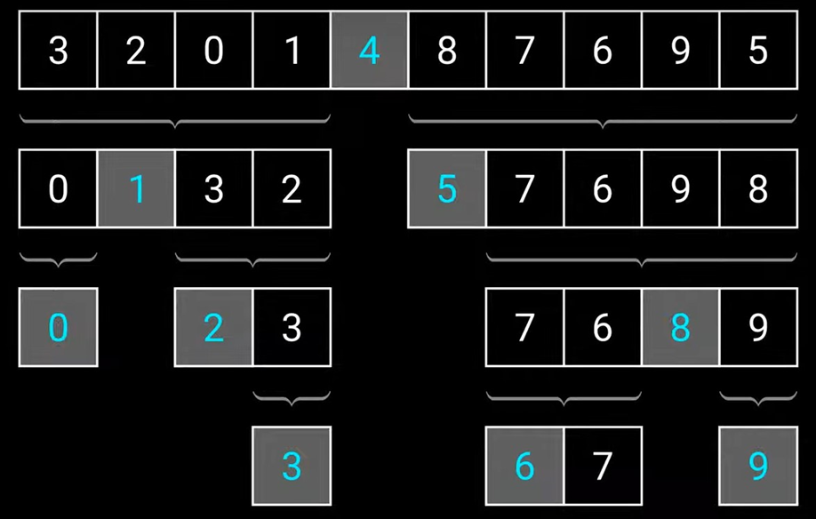

# Řadící algoritmy
Jsou pro setřídění prvků typicky v poli podle velikosti
- sestupně
- vzestupně

### Volba algoritmu
- Časová složitost, třeba: log n, n^2
- stabilita algoritmu
    - Říkáme, že je řazení stabilní, pokud nedojde v jeho průběhu k prohození prvků se stejnou hodnotou
    - třeba když máme 6 a 6, tak aby se zbytečně neprohazovali několikrát v průběhu

## Bubble sort
**Složitost O(n<sup>2</sup>)**

Postupně projede pole n-1 krát, porovná 2 sousední prvky, když je 1. větší než 2., prohodí se (vzestupně), když chceme sestupně tak naopak :)


### Pseudocode

```python
    int[] pole = {...};

    for(int i = 0; i < pole.lenght-2; i++) {
        if(pole[i] > pole[i+1]) {
            switchElement();
        }
    }
```

## Insert sort
**Složitost O(n<sup>2</sup>), když je pole celkem seřazené, blíží se k O(n)**

Vezmeme n-tý prvek, ten porovnáme s předchozím, postupně tento prvek posouváme, dokud není na správném místě, opakujeme dokud není pole seřazené¨


### Př.

    (3 2 8 7 6) // Zadání, prvek 3 je triviálně seřazen
    (3 2 8 7 6) // Vezmeme dvojku a vložíme jí na správné místo (tam už je)
    (3 2 8 7 6) // 8 vložíme na první místo, zbytek čísel posuneme
    (8 3 2 7 6) // 7 vložíme mezi 8 a 3, 3 a 2 posuneme
    (8 7 3 2 6) // 6 vložíme mezi 7 a 3, čísla 3 a 2 posuneme
    (8 7 6 3 2) // seřazeno

### Pseudocode

```python
    int[] pole = {...};
    for (int i = 0; i < pole.lenght; i++) {
        j = i + 1;
        tmp = pole[j];

        while (j > 0 && tmp > a[j-1]) {
            pole[j] = pole[j-1]   
            j--
            pole[j] = tmp
        }
    }
```

## Select sort
**Složitost O(n<sup>2</sup>)**

**Výhoda oproti předchozím je jeho konstantní paměťová složitost**

Projede pole, najde nevětší číslo a dá ho na začátek (nakonec, při vzestupně), potom projede pole kromě 1. indexu, najde číslo, dá ho na druhý index (na předposlední, při vzestupně). Takhle to opakuje pole.lenght-1 krát.


### Př.

    (3 2 8 7 6)
    
    (3 2 8 7 6) // nejvyšší číslo je 8, prohoďme ho tedy s číslem 3 na indexu 0
    (8 2 3 7 6) // nejvyšší číslo je 7, prohoďme ho tedy s číslem 2 na indexu 1
    (8 7 3 2 6) // nejvyšší číslo je 6, prohoďme ho tedy s číslem 3 na indexu 2
    (8 7 6 2 3) // nejvyšší číslo je 3, prohoďme ho tedy s číslem 2 na indexu 3

    (8 7 6 3 2)

### Pseudocode
asi neni potreba lol

## Quicksort
**Složitost O(n . log n), nejhorší O(n<sup>2</sup>)**

Velmi rychlý, na principu *"rozděl a panuj"*

Princip je trochu složitější. Obrázek snad pomůže... Takže, zvolíme si pivota (nejlepší pivot je median), toho dáme, menší prvky než pivot dáme do leva, větší do prava, pivot bude mezi nimi, **pivot je v této chvíli na spráném místě** a už s ním nehýbeme. Pole máme nyní rozdělené na dvě části. Pro každou část zvolíme samostatného pivota opakujeme předchozí krok. Opakujeme dokud nebude pole seřazené.




### Pseudocode
Pseudocode sem radsi ani nebudu davat xd