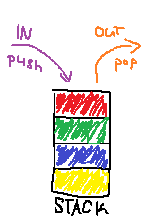
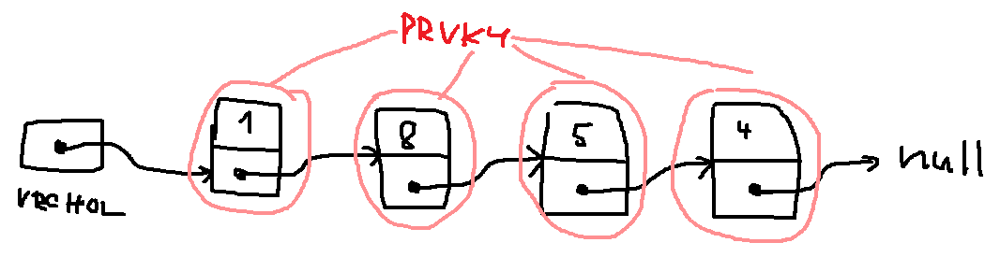
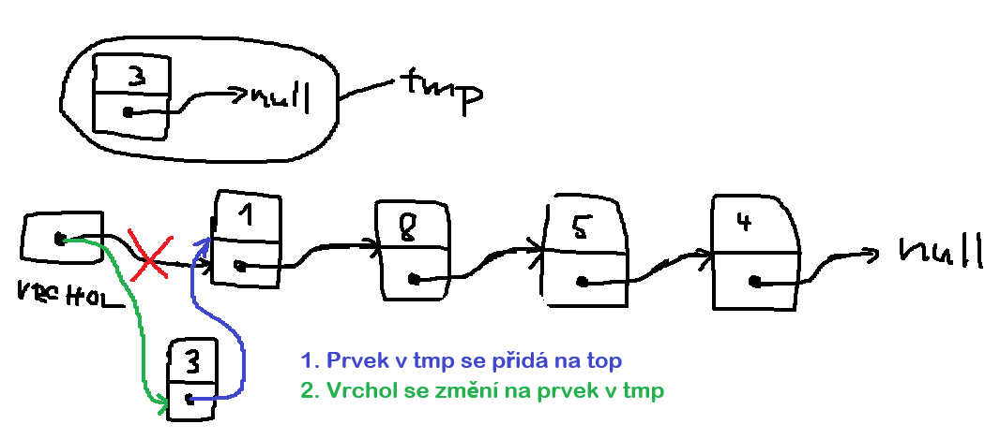
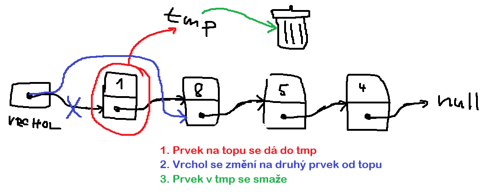
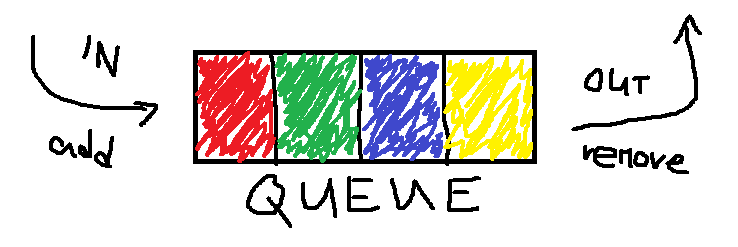

# Abstraktní datové typy (ADT)

### Abstrakce
Řekneme algoritmu co má dělat, a ten to "magií" udělá. Implementace záleží na daném jazyce, v Javě, v C, nebo v C++ jsou algoritmy úplně jiné.

## Zásobník (Stack)
- vertikální uspořádání
- LIFO (Last in, first out / poslední přidanej jde první ven)
- musí se pracovat jen s tím prvkem co je nejvýše
    - chci ten prvek co je úplně dole, musím vyndat všechny ty předtím
- `push`, `pop`

### Fungování zásobníku

#### Struktura

#### Přidání prvku

#### Odebrání prvku

## Fronata (Queue)
- horizontální uspořádání
- můžeš si představit i jako trubku (pipeline)
- FIFO (First in, first out / první přijdu, první odejdu)
- `add`, `remove`
- jako cache paměť

