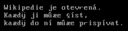
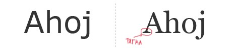
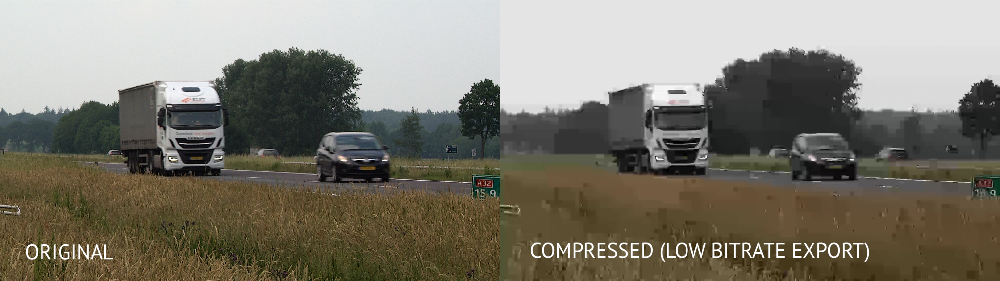
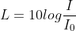
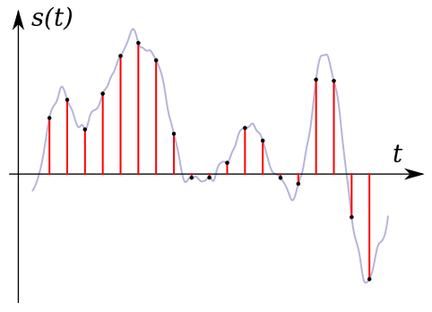

# Kódování dat

### Datové formáty
Určení reprezentace dat a následná interpretace dat

Určují jak jsou uložené v paměti, tzn. prostě co ty bity a bajty v paměti znamenají a co určují

# Soubory
Množina dat, uložená na dat. mediu. Posloupnost bitů

#### 1. Datda
Samotná data V SOUBORU
#### 2. Metadata
Popisují CELÝ soubor na disku
- jméno
- přípona (typ) - .png; .txt; .java; .docx ...
- délka (velikost)
- oprávnění (Linux: rwx)
- vlastník
- časové info (čas vytvoření, čas poslední změny...)
- umístění vlastních dat – typicky posloupnost alokačních jednotek
- atd...

## Souborový systém (file system)
Uspořádaní souborů v OS na dat. médiu
- Windows
    - ntfs
- Linux
    - ext4, 3, 2
- Mac
    - AFS - Apple File System
- General
    - fat32, exFAT

# Textové
Posloupnist bitů, která je poté kódována na text pomocí **znakových sad**
## Znakové sady
### 1. ASCII
- nejstarší
- 1 byte (číslo) = 1 znak
- 256 znaků

### 2. UNICODE - UTF-8
- šestnáctková soustava
- dnes většina souborů, web...
- založen na ASCII
- všechny abecedy
- 140 000 znaků
- podporuje emoji 🥶

### 3. CP 582 Latin 2
- latinka, MS DOS
#### Kód Kamenických
- založený na CP ↑ kde byly kódové body 128 až 171 nahrazeny znaky české a slovenské abecedy

### 4. ISO 8859-2
- Linux
### 5. Windows 1250
- latinka, včetně Čj

## Fonty
#### Bezpatkové
- Arial
#### Patkové
- Times New Roman

## Převod souborů
- do jiných typů
- programy

# Komprese
Cíl je finální zmenšení objemu dat (velikosti)

### Ztrátové
- daleko větší zmenšení, zato ale ztráta informace
- jpg, mp3

### Bezeztrátové
- menší zmenšení, ale informace zůstává stejná
- png, flac; zip, 7z (kinda)

# Foto

## Rastrová x Vektorová grafika

### Rastrová
Obraz uložen v bodech - **pixelech**, upořádaný do mřížky - **bitmapy**

**Programy:** Photoshop, GIMP, paint.net .. 

**Vhodné pro fotky**

.png, .jpg, .gif, .WebP ...

#### Každý pixel má vlastnosti
- polohu
- barvu
- průhlednost (u formátu podporující jí - png, gif ...)
- ...

#### Vlastnosti celého rastru
- Rozměr v pixelech (např. 800x600)
- Barevná hloubka (počet bitů)
    - 8bit - 256 barev, 16bit - 65536 ...
- DPI - Dots Per Inch - kolik pixelů na délku jednoho palce = kvalita rastru

### Vektorová

Celý obraz se zkládá z křivek, vektorů a geom. obrazců -> zápis pomocí mat. předpisů (analytická geom.)

Jde exportovat na rastr, **rastr ale nejde převést na vektor**

Výhodou je že když měníme velikost obrázku, **jeho kvalita zůstává 100%**. Velikost na disku zůstává stejná -> výhoda, při vyšším DPI (rastr by byl obrovskej)

**Programy:** Ilustrator, Inkscape ...

.svg, .pdf, .eps ...

# Video
Spoustu snímků v sekvenci

- rozlišení snímků
- snímková frekvence - FPS - Frame Per Second (25FPS, 30FPS, 60FPS) - čím vyšší, tím plynulejší obraz
- datový tok - bitrate - čím nižžší, tím víc je video horší, různé artefakty ... 
- kontrast, jas, barvení ...

*Nízký bitrate*

**Programy:** Premiere, DaVinci Resolve, Movie Maker ...

.mp4, .avi, .mov, ...

# Zvuk
Zvuk - mechanické vlnění v látkovém prostředí (vzduch)

Lidské ucho slyší v rozmezí cca 20 Hz – 20 000 Hz

- Tón - čím vyšší frekvence vlny, tím vyšší tón
- Barva - při stejném tónu můžeme rozeznat zvuk kytary, piána, nebo hlas člověka, to je dáné dalšími vlnami v té dané "tónové" vlně, těm se říká **harmonické frekvence**
- Hlasitost - **subjektivní veličina**

    
    
    V decibelech - dB

Do počítače zvuk dostaneme A/D (analog-digital) převodníkem, který využívá tzv. **vzorkování** viz. Pan CJ

*Vzorkování*

### Zvuk v prostoru
- Mono
    - jedna stopa
- Stereo
    - 2 stopy, měněním signálu obou stop můžeme docílit prostorového zvuku
- 5.1, 7.1 ...
    - více stop, více reproduktorů, více prostorový zvuk :)