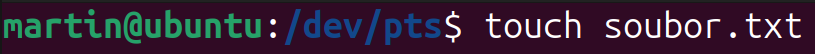

# Linux
- multitaksový, multiusererový operační systém

## Linuxové distribuce
- samotný "Linux", je jen jádro (kernel), vývojaři **Linuxových distribucí** vezmou tohle jádro a přidají si své, ty si pak můžeš stáhnout a nainstalovat jako OS

- Debian
    - Ubuntu (Xubuntu, Kubuntu, Lubuntu) - jména flavorů jsou podle **Desktop Enviroments**
    - Linux Mint
- Arch Linux - pro zkušenější uživatele, můžeš si navolit co tam chceš
    - Manjaro
- ...
## Desktop Enviroments (GUI)
- textové prostředí, můžeme doinstalovat GUI (říká se jim **Desktop Enviroments**)

- GNOME (noum) - Ubuntu, ...
- KDE Plasma
- XFCE
- MATE (mátej) - Linux Mint, ...
- ...

Většina jich je zdarma, některé můžou být placené (spíš pro korporátní distribuce, nebo "professional" distribuce)

## Uživatelé
- několik uživatelů, ty můžeme řadit do skupin (jméno heslo atd.)

### Super User (SU)
Nebo taky "root" user
Administrátorský uživatel, **doporučeno se za něj nepřihlašovat**. Když potřebujeme admin oprávnění, je lepší metoda místo přihlašovaní se za něj vyvolat příkaz `sudo` před příkaz vyžadující admin oprávnění. Zadáme heslo svého uživatelského účtu.


Zkusíme se `sudo`


Už to jede yay

## Swap
Je to partition (oddíl) na disku. Když nám dojde RAM, tak to bere ze Swap

## Základní příkazy
[Ubuntu Wiki - Základní příkazy](https://wiki.ubuntu.cz/z%C3%A1kladn%C3%AD_p%C5%99%C3%ADkazy)

### Prompt

`UZIVATELSKE_JMENO@JMENO_ZARIZENI: AKTUALNI_ADRESAR$PRIKAZOVY_RADEK`

pozn. místo **$** tam může být i **#**, když jsme přihlášeni jako **SU**


Tilda/vlnovka (~) značí uživatelův domovský adresář

- `cd [path]`
    - relativní
        - `cd mojeslozka` - přesunutí se o složku dopředu
        - `cd ..` - přesunutí se o složku zpátky
    - absolutní `cd /home/uzivatel/mojeslozka` - vypíšeme absolutní cestu do složky
- `pwd` - vypsání aktualní cesty, kde jsme
- `ls` - vypsání obsahu adresáře
    - `ls -l` - vypsání ve formě lisu (**i s oprávněníma**)
- `touch soubor.txt` - vytvoření soubotu
- `mkdir mojeslozka` - vytvoření složky
- `rm soubor.txt` - vymazaní souboru
- `rmdir mojeslozka` - vymazání složky
- `cp soubor.txt souborkopie.txt` - kopírovaní souboru
- `mv soubor.txt ./mojeslozka/soubor.txt` - přesunutí souboru
- `cat soubor.txt` - vypsání obsahu souboru do terminalu
- `chown pepazdepa soubor.txt` - změní vlastníka souboru na uživatele pepazdepa
- `sudo passwd pepazdepa` - změní heslo uživatele pepazdepa

#### Kdykoli, když budete ztraceni, stačí napsat `příkaz --help`, ono vám to vypíše nápovědu k příkazu
- pro rozšířenější nápovědu: `man příkaz` (ukončíte pomocí "q")

## Oprávnění
[Wiki na oprávnění - chmod](https://wiki.ubuntu.cz/chmod)

- pomocí příkazu `chmod soubor/složka`

První pozice je pro typ souboru
- `-` - soubor
- `d` - složka (directory)
- `l` - odkaz (link), třeba na jiný soubor na disku
- je jich víc tohle jsou takový základní (viz. [Wiki na oprávnění - chmod](https://wiki.ubuntu.cz/chmod#typy_soubor%C5%AF))


## Skripty
Možná po vás budou chtít napsat jednoduchý skript a spustit ho. IDK

Taaaakže

`touch skript.sh` - vytvoříme soubor

`nano skript.sh` - otevřeme soubor v text. editoru **nano**

```sh
#!/BIN/BASH
# ^ musí bejt na začátku každýho skriptu

echo "Ahoj"     # vypíšeme do konzole "Ahoj"
```
###### Ctrl+X, Y, Enter zavřeme

`chmod +x skript.sh` - přidáme executable oprávnění, pomocí zkratky +x

`./skript.sh` - spustíme skript

# Pozn. na konec
Nevim jestli když to exportnu do pdf, tak jeslti tam pujde kliknout na odkazy, tak je radši dávám ještě sem...

- Ubuntu Wiki - Základní příkazy - https://wiki.ubuntu.cz/z%C3%A1kladn%C3%AD_p%C5%99%C3%ADkazy
- Wiki na oprávnění - chmod - https://wiki.ubuntu.cz/chmod

